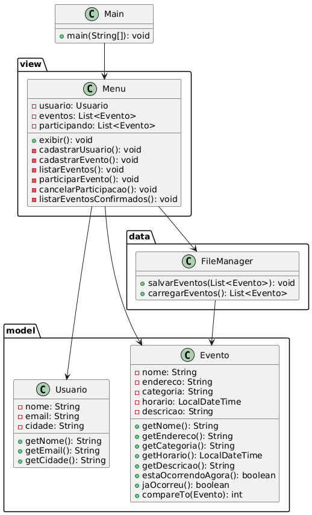

# 🎉 Sistema de Cadastro e Notificação de Eventos (Console - Java)

Este projeto é um sistema de console desenvolvido em Java com base no paradigma de **Programação Orientada a Objetos (POO)**. Ele permite o **cadastro de usuários**, **eventos**, **confirmação de presença** e **notificação sobre eventos ocorrendo ou passados**, com foco em eventos na cidade do usuário.

---

## 📌 Funcionalidades Principais

### 👤 Gestão de Usuários
- Cadastro de usuário (nome, email, cidade)
- Armazenamento das preferências do usuário

### 🎪 Gestão de Eventos
- Cadastro de eventos com:
  - Nome
  - Endereço
  - Categoria (festa, show, esportivo, etc.)
  - Data e hora (com validação de formato)
  - Descrição
- Listagem de eventos filtrados por cidade do usuário
- Ordenação de eventos por data e hora
- Indicação de status (ocorrendo agora, futuro ou passado)

### ✔️ Participação
- Confirmação de presença em eventos
- Cancelamento de participação

### 💾 Persistência de Dados
- Armazenamento automático em arquivo `events.data`
- Carregamento automático ao iniciar o programa

---

## 🏗️ Estrutura do Projeto
📁 src/
📄 Main.java (Ponto de entrada)
📁 model/
📄 Usuario.java (Classe de usuário)
📄 Evento.java (Classe de evento)
📁 data/
📄 FileManager.java (Gerenciador de arquivos)
📁 view/
📄 Menu.java (Menu interativo)
📄 events.data (Dados persistidos)
---

## 💾 Armazenamento de Dados

- **Persistência**: Todos os eventos são automaticamente salvos no arquivo `events.data`
- **Recuperação**: Os dados são carregados automaticamente na inicialização
- **Resiliência**: O arquivo é criado automaticamente se não existir

---

## 📐 Diagrama de Classes

